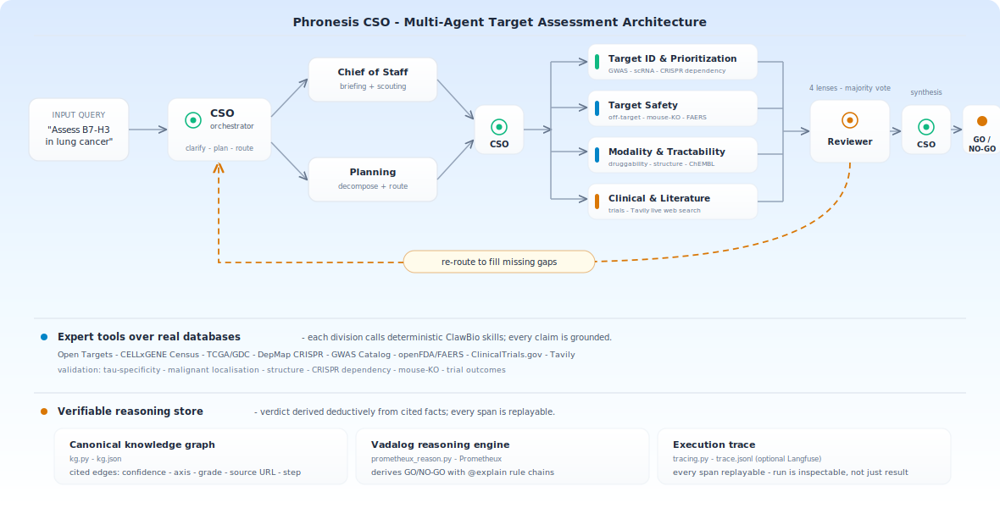
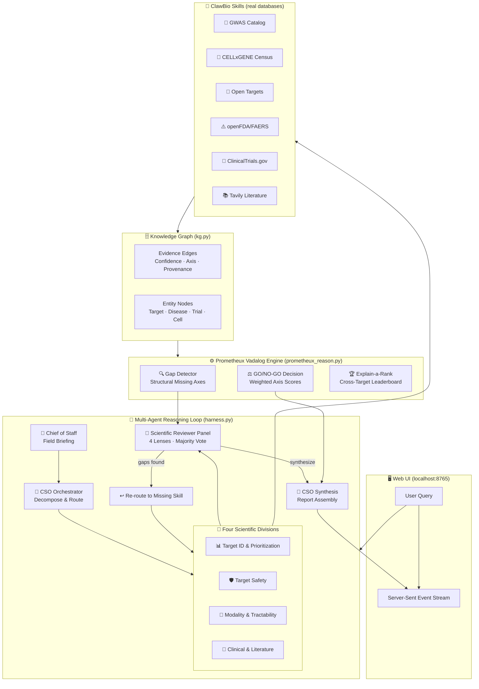
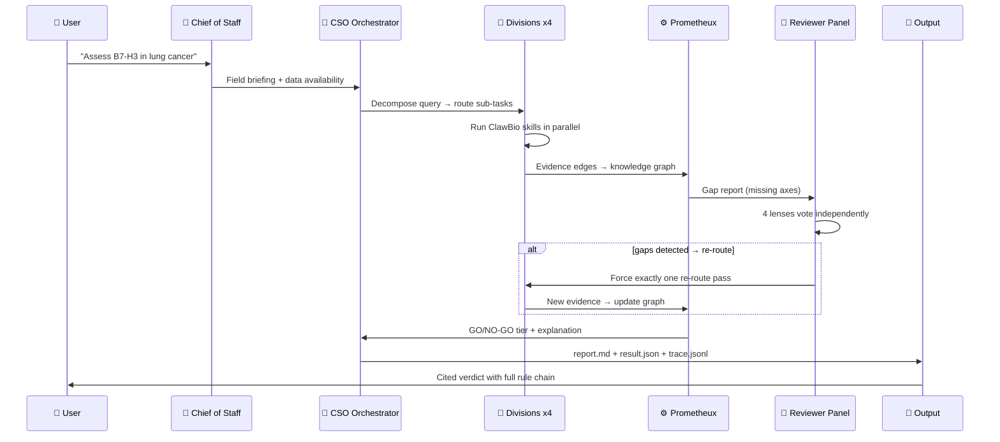
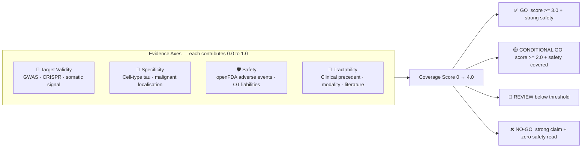
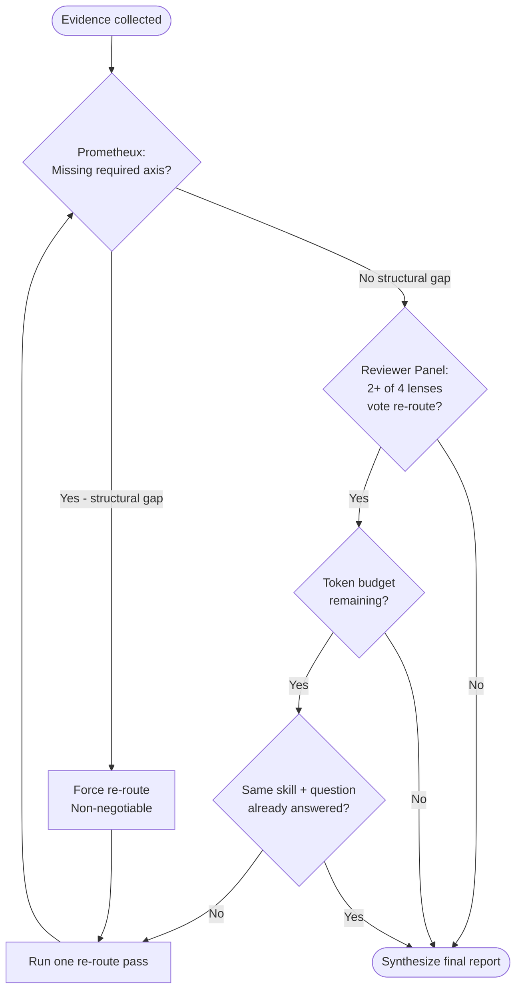
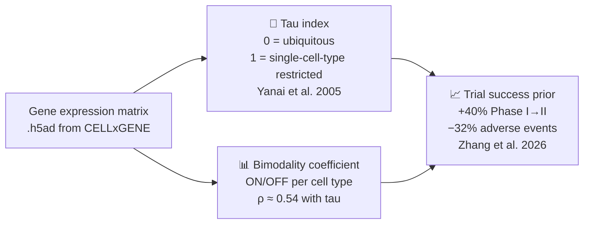

<div align="center">

# 🧬 Phronesis CSO

### *The Virtual Chief Scientific Officer — A Multi-Agent AI That Nominates Drug Targets and Shows Its Work*

[](https://prometheux.ai)
[](https://tavily.com)
[](https://clawbio.ai)
[](#-testing)
[-94a3b8?style=for-the-badge)](https://www.biorxiv.org/content/10.64898/2026.02.23.707551v1)

</div>

---

## 🎯 The Problem

Choosing the right drug target is the single most expensive decision in pharmaceutical R&D. **Nine out of ten clinical drug programs fail**, and most failures trace back to one mistake: picking the wrong target.

A landmark Stanford paper — *[The Virtual Biotech](https://www.biorxiv.org/content/10.64898/2026.02.23.707551v1)* (Zhang et al. 2026) — proved that a multi-agent AI can automate this decision reliably, and found a striking result: **targets with high cell-type specificity are 40% more likely to advance from Phase I to Phase II trials and carry 32% lower adverse-event rates.**

**Phronesis CSO turns that paper into a running production system.** It is a multi-agent AI organisation — a virtual R&D company — that:

- Decomposes any target-disease question into expert sub-tasks
- Routes those tasks to bioinformatics tools over live public databases
- Audits the evidence with a peer-reviewer panel
- Derives a **GO / NO-GO verdict deductively** using formal logic — not LLM guesswork
- Generates a fully cited, reproducible report with a replayable reasoning chain

> **The key insight:** The verdict is not *generated* by a language model. It is *derived* from cited evidence by a **Prometheux Vadalog logic engine** — the way a mathematician proves a theorem, not the way a chatbot summarizes text.

---

## 🗺️ System Architecture

<p align="center">
  <a href="docs/assets/architecture.svg">
    
  </a>
</p>

<details>
<summary><b>📐 Click here for the text-rendering (mermaid) version of the same diagram</b></summary>



</details>

### The Three Layers

| Layer | What It Does | Why It Exists |
|---|---|---|
| **Agentic Loop** | Agents plan, route, review, and synthesize | Automates the full R&D decision workflow end-to-end |
| **Expert Tools** | ClawBio skills call real databases deterministically | Every claim in the report is grounded in real biology |
| **Reasoning Engine** | Prometheux Vadalog derives the verdict formally | The conclusion is provable from cited facts, not generated |

---

## 🤖 The Multi-Agent Organisation

Phronesis CSO is a **genuine multi-agent system**, not a single prompt with a collection of tools. Five distinct roles operate in sequence, and the reviewer panel is a genuine vote.



### Agent Roles Explained

| Role | What It Does | Why Not Just One Agent? |
|---|---|---|
| **Chief of Staff** | Produces a briefing before anything starts — what is known about this target, what data is available, likely gaps | Without this, the CSO would plan blind and waste agent calls |
| **CSO Orchestrator** | Reads the briefing, decomposes the query into sub-tasks, routes each to the right ClawBio skill | Specialisation: the orchestrator is a project manager, not a scientist |
| **Scientist Divisions** (×4) | Each runs its assigned ClawBio skills over real databases and records cited evidence edges | Parallelism + specialisation: genetics, safety, tractability, and clinical are genuinely different domains |
| **Scientific Reviewer Panel** | Four lenses (completeness, methodology, safety, recency) each vote independently; majority re-routes | Adversarial review catches gaps the scientists didn't know to look for |
| **Prometheux Gap Detector** | Non-silenceable fifth panel member — detects structurally missing axes with formal logic | An LLM reviewer might ignore a missing axis; formal logic cannot |

---

## ⚙️ The Vadalog Reasoning Engine

This is the scientific heart of the project.

### What is Vadalog?

[Vadalog](https://prometheux.ai) is a logic programming language for knowledge graphs. Instead of asking "what does the AI think?", you write rules:

```prolog
%% A target has a 'strong claim' on an axis if confidence >= 0.8
strong_claim(T, Ax) :- evidence(T, Ax, C), C >= 0.8.

%% A target is missing an axis if no evidence exists
missing_axis(T, Ax) :- target(T), required_axis(Ax), not has_axis(T, Ax).

%% Unsafe advance: strong claim somewhere but NO safety read
unsafe_advance(T) :- strong_claim(T, _), not has_axis(T, "safety").

%% Explain-a-rank: A ranks over B because A is strong on Ax and B is not
differentiates(A, B, Ax) :- strong_claim(A, Ax), not strong_claim(B, Ax).
```

The engine **proves** these from cited evidence facts. The rule chain is shown explicitly with `@explain`.

### The Four Decision Axes



**The safety hard-gate:** A target can score perfectly on three axes — but if there is **zero safety evidence**, `unsafe_advance` fires and returns NO-GO regardless of score. An LLM might silently skip this; formal logic cannot.

### Evidence Grades

| Grade | Weight | Meaning |
|---|---|---|
| `strong` | 1.0 | Direct experimental proof, high confidence |
| `supporting` / `illustrative` | 0.5 | Corroborating evidence, well-sourced |
| `suggestive` | 0.25 | Indirect or low-power signal |
| `absent` | 0.0 | Step ran but returned no data |

---

## 🔄 The Re-Route Control Loop

The reviewer panel can force the loop back to collect missing evidence. This is governed by three convergence guarantees:



**Three convergence guarantees (all regression-tested):**

1. **Budget gate** — only chases gaps while token spend stays under `DEFAULT_TOKEN_BUDGET = 60,000`
2. **No thrash** — if re-route calls the exact same skill with the same question, it is skipped. The loop deepens, it does not spin
3. **One forced pass only** — a structural gap triggers exactly one re-route, then moves to synthesis regardless

---

## 🌐 The Web UI

Start the server and open `http://localhost:8765/app`:

```bash
python frontend/server.py
```

The UI has six tabs:

| Tab | What it shows |
|---|---|
| **Loop Trace** | Real-time streaming of every agent event as the loop runs |
| **Evidence Graph** | Interactive knowledge graph — nodes and edges from all evidence steps |
| **Axis Scorecard** | The four-axis breakdown: grade, weight, evidence items per axis |
| **Report** | Full cited markdown report with all references |
| **Evidence Ledger** | All evidence edges across all runs in the session |
| **Target Ranking** | Cross-target leaderboard with Prometheux `differentiates` explanations |

---

## 🧬 The Cell-Type Specificity Primitive

The paper's key predictive signal was cell-type specificity, but none of the 128 existing ClawBio skills computed it. We built it:



**Why tau?** A gene expressed only in lung tumour cells (tau = 0.9) is a much safer drug target than one expressed across all tissues (tau = 0.1). You hit the tumour without damaging healthy cells.

**Why bimodality?** The bimodality coefficient (from psychometrics) detects genes that are either ON or OFF in specific cell types. It independently predicts trial success and correlates with tau (ρ ≈ 0.54).

---

## 📁 Repository Structure

```
phronesis-cso/
│
├── skills/
│   ├── phronesis-cso/                    # PRIMARY — the orchestration layer
│   │   ├── cso.py                        # Core logic: routing, synthesis, evidence grading
│   │   ├── harness.py                    # Full agent loop: brief→route→review→synthesize
│   │   ├── prometheux_reason.py          # Vadalog program: gaps + decision + ranking
│   │   ├── kg.py                         # Knowledge graph: nodes, edges, upsert, ledger
│   │   ├── routing.yaml                  # Query intent → ClawBio skill routing map
│   │   ├── runners.py                    # LLM backend adapters (Anthropic/NVIDIA/OpenAI/Gemini)
│   │   ├── tracing.py                    # trace.jsonl writer + optional Langfuse mirror
│   │   ├── primekg_enrich.py             # PrimeKG corroborating edge enrichment
│   │   ├── prompts/
│   │   │   ├── chief_of_staff.md         # Agent prompt: field briefing
│   │   │   ├── orchestrator.md           # Agent prompt: CSO synthesis
│   │   │   ├── reviewer.md               # Agent prompt: scientific reviewer
│   │   │   └── division_scientist.md     # Agent prompt: division scientist
│   │   └── demo_data/b7h3/               # Cached offline fixtures (B7-H3 case study)
│   │
│   ├── celltype-specificity-profiler/    # SUPPORTING — tau + bimodality primitive
│   ├── cellxgene-fetch/                  # CELLxGENE Census API wrapper
│   ├── malignant-expression-profiler/    # Tumour vs normal expression
│   ├── gwas-lookup/                      # GWAS Catalog + Open Targets genetic evidence
│   ├── openfda-safety/                   # FDA FAERS adverse event snapshot
│   ├── opentargets-target-factors/       # OT prioritisation, tractability, safety liabilities
│   ├── clinical-trial-finder/            # ClinicalTrials.gov live search
│   ├── lit-synthesizer/                  # Tavily-powered live literature search
│   └── tcga-somatic-profiler/            # TCGA/GDC somatic mutation frequency
│
├── frontend/
│   ├── server.py                         # HTTP server: SSE streaming + static serving
│   ├── app.jsx / app.js                  # React UI: loop trace, graph, scorecard, report
│   ├── index.html                        # App shell
│   └── site/
│       ├── index.html                    # Marketing landing page
│       └── schematic.html                # Interactive system schematic
│
├── docs/
│   ├── ENVIRONMENT.md                    # All environment variables explained
│   └── assets/architecture.svg          # System architecture diagram
│
├── tests/                                # 133 tests, all passing
│   └── test_prometheux_reason.py         # Vadalog reasoning + gap detector
│
└── workflows/
    └── b7h3_adc_nomination.md            # Full B7-H3 ADC case study walkthrough
```

---

## 🚀 Quick Start

### Web UI (Recommended)

```bash
# 1. Install
pip install -r requirements.txt

# 2. Start server
python frontend/server.py
# → http://localhost:8765

# 3. Open browser, type any query in Demo mode
```

### Command Line

```bash
# Full offline demo — no keys, no network
python skills/phronesis-cso/harness.py --demo

# Custom query, still offline
python skills/phronesis-cso/harness.py --demo --query "Assess HER2 in breast cancer"

# Live mode with real databases
python skills/phronesis-cso/harness.py --live --backend auto \
       --query "Assess KRAS G12C in colorectal cancer"
```

### ClawBio Platform

```bash
pip install clawbio
clawbio run phronesis-cso --demo
clawbio run celltype-specificity-profiler --demo
```

---

## ⚙️ Configuration

Copy `.env.example` to `.env`. Everything works with zero keys in demo mode. All configurations are centralized and validated via `PhronesisSettings` (see `skills/phronesis-cso/settings.py`).

### LLM Backends (auto-selected in order)

| Priority | Variable | Default Model | Runner |
|:---:|---|---|---|
| 1 | `ANTHROPIC_API_KEY` | `claude-sonnet-4-6` | `AnthropicRunner` |
| 2 | `NVIDIA_API_KEY` | `nvidia/nemotron-3-super-120b-a12b` | `NIMRunner` |
| 3 | `OPENAI_API_KEY` | `gpt-4o-mini` | `OpenAIRunner` |
| 4 | `GEMINI_API_KEY` / `GOOGLE_API_KEY` | `gemini-2.5-flash` | `GeminiRunner` |

Override models via specific model environment variables (e.g. `ANTHROPIC_MODEL`, `NIM_MODEL`, `OPENAI_MODEL`, `GEMINI_MODEL`, `VBIO_MODEL` for global override). Timeout overrides can be set via `ANTHROPIC_TIMEOUT_S`.

### Reasoning Engines & Integrations

| Engine/Integration | What It Powers | Key Variables | Offline Fallback |
|---|---|---|---|
| **Prometheux** | Hosted Vadalog SaaS + PrimeKG | `PMTX_TOKEN` + `JARVISPY_URL` | In-process local Python Datalog |
| **Neo4j DB** | Local graph reasoning + Cypher | `NEO4J_URI` + `NEO4J_USER` + `NEO4J_PASSWORD` | In-process local Python Datalog |
| **Tavily** | Live literature search | `TAVILY_API_KEY` | Cached static demo fixtures |
| **Langfuse** | Cloud agent tracing | `LANGFUSE_PUBLIC_KEY` + `LANGFUSE_SECRET_KEY` | Local `trace.jsonl` files |
| **ClawBio** | Bioinformatics tools runner | `clawbio` CLI | Bundle-integrated demo fixtures |

---

## 🔑 Key Features Explained

### Type-Safe LLM Boundaries (Pydantic v2)
All agent JSON payloads (briefing, planner, reviewer panel, division findings, synthesis) are strictly validated at the boundary via Pydantic v2 models (see `skills/phronesis-cso/schemas.py`). Bad LLM shapes are caught instantly, avoiding downstream execution failures.

### Tenacity HTTP Retry Policy
LLM requests are protected by exponential-backoff retries using `tenacity` (see `skills/phronesis-cso/runners.py`). Transient connection errors, API timeouts, and 429 rate limit spikes are retried up to 5 times (max 30s backoff) before failing.

### Open-Source Neo4j Graph Reasoning
As an alternative to Prometheux SaaS, graph reasoning can run locally on Neo4j using Cypher queries (see `skills/phronesis-cso/neo4j_reason.py`). It pushes evidence to your local graph database and proves identical logic patterns (`co_niche`, `shares_axis`, `strong_claim`, `differentiates`).

### Persistent In-Process Cache (`diskcache`)
Successive knowledge-graph reads avoid re-parsing file overhead using `diskcache` (see `skills/phronesis-cso/kg.py`). Cache invalidation is automatic: keys are bound to the file's `mtime_ns` and `size`, so any graph write (`commit()`) busts the cache instantly.

### Structured Logging (`structlog`)
Structured telemetry events are output using `structlog` (see `skills/phronesis-cso/harness.py`). It prints clean, colorized box-drawing lines on interactive TTY stdout and switches to JSON format when stdout is redirected to journalctl or log collectors.

### Server-Side Rate Limiting & CORS
The web backend (see `frontend/server.py`) includes a token-bucket rate limiter (steadystate per-IP limit `RATE_LIMIT_PER_MIN`, burst capacity `RATE_LIMIT_BURST`, and global concurrent SSE cap `RATE_LIMIT_CONCURRENT`). It also exposes standard CORS preflight `OPTIONS` with cached max age.

### Demo Mode — Any Query Works
Type any target-disease combination in demo mode and get a complete, customised report instantly. The system dynamically adapts the B7-H3 fixtures to match your query.

### Streaming Evidence in Real Time
Every agent event is streamed to the browser via Server-Sent Events. You can watch the knowledge graph build edge-by-edge as the loop runs.

### Persistent Knowledge Graph
Evidence accumulates across all queries in a session. Cross-target ranking explains *why* one target ranks over another on each axis using the Prometheux `differentiates` predicate.

### Human-in-the-Loop Gate
Enable `hitl=1` in the URL to pause the loop at each reviewer checkpoint for a human decision via `/api/decision`. Auto-approves after 3 minutes if no decision arrives.

### x402 Payment-Gated Cited Report
`/api/report` returns HTTP 402 on first access with payment terms. A retry carrying a valid `X-PAYMENT` header receives the full `cited.md` with a settlement receipt — demonstrating agent-economy IP monetisation.

### Non-Silenceable Safety Hard-Gate
A target with strong validity evidence but zero safety evidence is `unsafe_advance` — NO-GO regardless of total score. This is a formal logic rule, not an LLM opinion.

---

## 🧪 Testing

```bash
python -m pytest                    # 133 tests
python -m pytest -v                 # verbose
python -m pytest tests/test_prometheux_reason.py -v   # reasoning layer only
```

| Test file | Coverage |
|---|---|
| `test_cso.py` | Routing, evidence grading, plan validation, re-route logic |
| `test_harness.py` | Full loop, convergence, budget gating, deeper re-route |
| `test_prometheux_reason.py` | Vadalog rules, gap detector, decision tiers, safety hard-gate |
| `test_profiler.py` | Tau index, bimodality coefficient, cell-type ranking |
| `test_openfda_safety.py` | FDA adverse event parsing |
| `test_opentargets_*.py` | Open Targets GraphQL response parsing |
| `test_tcga_somatic_profiler.py` | TCGA mutation frequency computation |

---

## 📊 The B7-H3 Case Study

The default demo walks through **B7-H3 (CD276)** as an ADC target in **NSCLC**:

| Evidence Step | Skill | Finding |
|---|---|---|
| Genetic support (GWAS) | `gwas-lookup` | Limited genome-wide signal — expression target, not genetics target |
| Cell-type expression | `cellxgene-fetch` | High expression in lung adenocarcinoma tumour cells |
| Specificity (tau) | `celltype-specificity-profiler` | tau = 0.74 — moderately specific; fibroblast co-expression is primary liability |
| Off-target safety | `openfda-safety` | Moderate-low risk; no FAERS boxed warning for CD276-targeting agents |
| Clinical precedent | `clinical-trial-finder` | Multiple Phase I/II ADC programs active |
| Literature | `lit-synthesizer` | Strong competitive landscape; ADC modality validated |

**Verdict: CONDITIONAL GO** — Coverage 2.5/4.0. Safety covered, tractability strong. Genetics weak (expected for an ADC target). Recommend re-route to malignant-expression-profiler.

---

## 🏆 Prize Targeting

> 🎯 **Prometheux Intelligence Prize** — The entire verdict layer is a Vadalog program: recursive rules, `@model`/`@explain` annotations, structural gap-detector that forces re-work from deductive facts, `differentiates` predicate for explain-a-rank.

> 🔍 **Tavily Prize** — `lit-synthesizer` uses Tavily for three-angle live search (recent papers · competitive landscape · safety signals). Every result cited with source URL.

> 🧬 **ClawBio Prize** — All scientist agent tools run on ClawBio. We contribute two new skills: `phronesis-cso` and `celltype-specificity-profiler`.

---

## 📚 References

- **Paper:** [The Virtual Biotech](https://www.biorxiv.org/content/10.64898/2026.02.23.707551v1) — Zhang, Eckmann, Miao, Mahon & Zou, Stanford / PHD Biosciences, 2026
- **Platform:** [ClawBio](https://clawbio.ai/) · [Prometheux](https://prometheux.ai) · [Tavily](https://tavily.com)
- **Databases:** [Open Targets](https://platform.opentargets.org/) · [CELLxGENE](https://cellxgene.cziscience.com/) · [ClinicalTrials.gov](https://clinicaltrials.gov/) · [openFDA](https://open.fda.gov/) · [GWAS Catalog](https://www.ebi.ac.uk/gwas/)
- **Hackathon:** [Multiagents Hackathon](https://multiagents-hackathon.devpost.com/) — Tessl AI, London, 26 Jun 2026 · Sponsors: Google DeepMind · Prometheux · Tavily · ClawBio · Gensyn

---

<div align="center">
<sub>Phronesis CSO is a research and educational tool — not a medical device. Do not use for clinical decisions.</sub>
</div>
